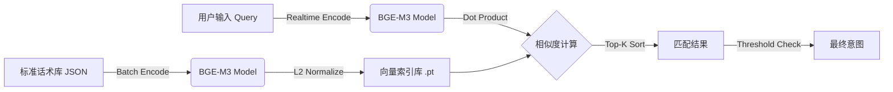

# 余弦相似度 + 标准话术向量库实施计划

## 1. 目标与设计理念
**核心目标**：构建基于语义的意图识别系统，通过计算用户输入与预设“标准话术”的向量相似度，实现泛化匹配。
**原理**：
1.  **离线阶段**：将标准话术库（Standard Scripts）预计算为 Dense Vectors，并存储为索引。
2.  **在线阶段**：将用户 Query 实时向量化，计算与索引库的余弦相似度（Cosine Similarity），过滤阈值后返回 Top-K。

## 2. 架构流程图



## 3. 详细执行步骤

### 阶段一：数据准备 (Data Preparation)
定义标准话术的数据结构。不仅仅存储文本，还需要存储对应的“意图代码”或“执行动作”。

*   **文件路径**: `data/standard_knowledge.json`
*   **数据结构**:
    ```json
    [
      {"id": 1, "text": "如何重置我的登录密码？", "intent": "reset_password", "category": "account"},
      {"id": 2, "text": "忘记密码怎么办", "intent": "reset_password", "category": "account"},
      {"id": 3, "text": "查询当前的流量余额", "intent": "check_balance", "category": "billing"}
    ]
    ```

### 阶段二：构建向量索引 (Offline Indexing)
编写脚本，读取 JSON，调用本地 BGE-M3 模型批量生成向量，并保存为 PyTorch 张量文件。

*   **脚本**: `build_vector_index.py`
*   **核心逻辑**:
    1.  加载 `serve_bge_m3_pro.py` 中的 `ModelManager`。
    2.  读取 `standard_knowledge.json`。
    3.  执行 `encode(texts, normalize=True)`。
    4.  保存 `vectors` (Tensor) 和 `metadata` (List[Dict]) 到 `model_index.pt`。
*   **性能考量**: 既然有 RTX 5090，索引构建应强制使用 GPU 加速。

### 阶段三：匹配引擎实现 (Matching Engine)
封装一个轻量级的匹配类，用于加载索引和执行搜索。

*   **模块**: `src/semantic_matcher.py`
*   **类定义**:
    ```python
    class SemanticMatcher:
        def __init__(self, index_path):
            # 加载向量矩阵 [N, 1024] 到 GPU
            # 加载元数据
        
        def search(self, query_vec, top_k=3, threshold=0.75):
            # 1. 计算相似度: scores = query_vec @ index_vectors.T
            # 2. 排序: values, indices = torch.topk(scores, k)
            # 3. 过滤: filter where values >= threshold
            # 4. 返回元数据
    ```
*   **阈值设定**: BGE-M3 在归一化后，推荐阈值在 **0.65 - 0.75** 之间（需实测校准）。

### 阶段四：服务集成 (Service Integration)
将匹配功能集成到现有的 API 服务中，提供专门的端点。

*   **修改文件**: `serve_bge_m3_pro.py`
*   **新增端点**: `POST /match`
    *   **Input**: `{"text": "我想改密码"}`
    *   **Output**: 
        ```json
        {
          "best_match": {"intent": "reset_password", "score": 0.82},
          "candidates": [...]
        }
        ```

## 4. 验证计划 (Validation)

| 测试用例 | 用户输入 (Query) | 预期匹配 (Standard) | 预期相似度 |
| :--- | :--- | :--- | :--- |
| **完全匹配** | "如何重置我的登录密码？" | "如何重置我的登录密码？" | ~1.0 |
| **语义泛化** | "密码忘了，帮我弄一下" | "忘记密码怎么办" | > 0.75 |
| **无关输入** | "今天天气怎么样" | (无) 或 低于阈值 | < 0.6 |
| **干扰测试** | "重置网络设置" | (区分于重置密码) | 需验证 |

## 5. 待办任务清单 (Todo List)

- [x] 创建示例数据 `data/standard_knowledge.json`
- [x] 编写索引构建脚本 `build_vector_index.py` 并执行
- [x] 编写匹配引擎类 `src/semantic_matcher.py`
- [x] 创建测试脚本 `test_similarity.py` 进行验证
- [x] 集成到 FastAPI 服务 (已新增 /match 端点)

## 6. 关键技术点备注
*   **归一化 (Normalization)**: 必须确保入库向量和查询向量都经过 L2 归一化，这样 `Dot Product` 才等于 `Cosine Similarity`。
*   **显存常驻**: 标准库向量（如 10万条 x 1024维 x FP16）约占用 200MB 显存，完全可以常驻显存以获得毫秒级响应。
